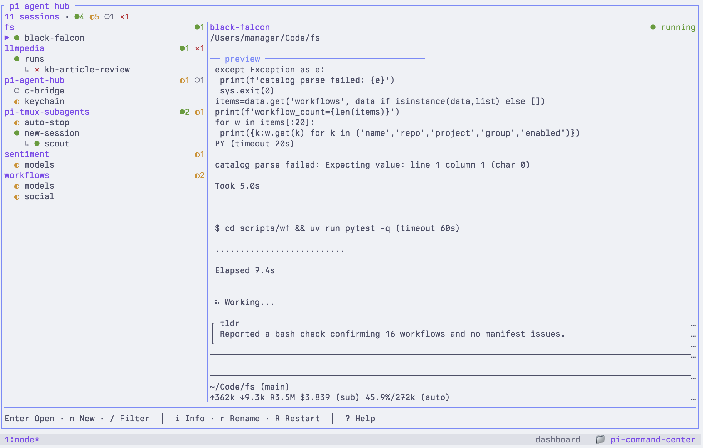

# pi-agent-hub

Pi-native tmux hub for long-running coding-agent sessions, skills, and MCP.

Use `pi-hub` to keep multiple Pi sessions visible, grouped, restartable, and easy to jump between from one terminal dashboard.



## Why pi-agent-hub?

Most agent managers try to become the runtime. `pi-agent-hub` stays small: Pi runs the agents, tmux keeps them alive, and the hub gives you one keyboard-driven dashboard to manage them.

| Feature | Why it matters |
| --- | --- |
| Pi-native | Uses Pi sessions, extensions, skills, MCP, and project state directly. |
| tmux-native | Sessions keep running as normal tmux sessions; you can attach, switch, or recover manually. |
| One stable dashboard | `pi-hub` always brings you back to the same control center. |
| Return shortcuts | `Ctrl+Q` jumps from a managed session back to the dashboard; `Alt+R` returns into rename. |
| Project-scoped skills/MCP | Pick skills and MCP servers for the selected session's primary repo. |
| Multi-repo without worktrees | Extra repos are symlinked into a runtime workspace; source repos are not moved or owned. |
| Small surface area | No cloud service, no custom agent runtime, no hidden repo scanning. |

## Quick start

Requirements: Pi and tmux.

```bash
pi install npm:pi-agent-hub
pi-hub doctor
pi-hub
```

Inside the dashboard:

| Key | Action |
| --- | --- |
| `n` | Create a new Pi session |
| `Enter` | Open or switch to the selected session |
| `Ctrl+Q` | Return from a managed session to the dashboard |
| `r` | Rename the selected session |
| `R` | Restart the selected session |
| `g` | Move the selected session to a group |
| `G` | Rename the selected session's group |
| `K` / `J` | Move the selected session up/down within its group |
| `s` | Pick project skills |
| `m` | Pick project MCP servers |

## Install

Install from npm:

```bash
pi install npm:pi-agent-hub
pi-hub doctor
pi-hub
```

The npm package is still `pi-agent-hub`; it exposes both commands, with `pi-hub` as the shorter daily-use command and `pi-agent-hub` kept for compatibility.

Local development install:

```bash
git clone https://github.com/masta-g3/pi-agent-hub.git
cd pi-agent-hub
npm install
npm run build
npm link
pi install "$PWD"
pi-hub doctor
pi-hub
```

- `npm link` provides the `pi-hub` and `pi-agent-hub` shell commands.
- `pi install "$PWD"` lets Pi discover the package extension through `package.json#pi.extensions`.
- Re-run `npm run build` after pulling updates.

Uninstall local setup:

```bash
pi remove /path/to/pi-agent-hub
npm unlink -g pi-agent-hub
```

## Development

```bash
npm test
npm run package:check
```

## CLI

```bash
pi-hub              # create/attach/switch to the dashboard tmux session
pi-hub tui          # run the TUI directly in the current terminal
pi-hub doctor
pi-hub list
pi-hub add . -t api -g default
pi-hub add ./api -t fullstack --add-cwd ../web --add-cwd ../shared
pi-hub delete <session-id>
pi-hub mcp-pool     # run the pooled MCP socket daemon
```

`add --add-cwd` creates a multi-repo session: `cwd` stays the primary repo, extra paths are symlinked into a per-session workspace, and Pi starts from that workspace. `delete` stops the tmux session if it is still alive, removes the registry row, removes the heartbeat file, and removes any owned multi-repo workspace. Pi conversation/session files and source repos are kept.

## Dashboard tmux behavior

Running `pi-hub` uses one stable tmux session named `pi-agent-hub`:

- outside tmux: create or attach `pi-agent-hub`;
- inside tmux: create it detached if needed, then switch the current client to it.

The dashboard runs `pi-hub tui` inside tmux so it does not recursively create dashboards. It also applies its own tmux status bar instead of inheriting global tmux theme chrome.

## TUI behavior

When the dashboard is running inside tmux, `Enter` switches the current tmux client to the selected managed session and shows the equivalent `tmux switch-client -t <session>` command. Opening a `waiting` session marks it read before attaching, so it can show `idle` after you return; `a` remains the manual mark-read shortcut.

Return shortcuts from a managed `pi-agent-hub-*` session:

| Key | Action |
| --- | --- |
| `Ctrl+Q` | Return to the dashboard |
| `Alt+R` | Return to the dashboard rename dialog for the current session, then switch back after saving |

If the dashboard tmux session is missing, the temporary return binding recreates it before switching back.

### New session form

Press `n` to create a session.

| Field | Default |
| --- | --- |
| Primary cwd | Selected session's cwd, or the dashboard cwd if nothing is selected |
| Extra repos | Selected session's extra repos, if any |
| Group | Primary cwd folder name |
| Title | Random two-word slug |

While editing the form:

| Key | Action |
| --- | --- |
| `Alt+A` | Add another repo row |
| `Alt+X` | Remove the focused extra repo row |
| `Ctrl+N` / `Ctrl+P` | Cycle known cwd suggestions |
| `Ctrl+O` | Open the recent-repo picker |

Extra repos are symlinked into one runtime workspace. The primary cwd remains the main project for skills and MCP state.

### Groups and session actions

Groups are simple labels on sessions.

| Key | Action |
| --- | --- |
| `g` | Move the selected session to a group |
| `G` | Rename the selected session's group everywhere |
| `K` / `J` | Move the selected session up/down within its group |
| `Shift+Up` / `Shift+Down` | Same as `K` / `J` |
| `r` | Rename the selected session |
| `R` | Restart the selected session |

Reordering is disabled while a filter is active.

## Advanced

### Pi package

The package declares its extension in `package.json`:

```json
{
  "pi": {
    "extensions": ["dist/src/extension/index.js"]
  }
}
```

Package smoke before publishing:

```bash
npm run package:check
npm publish --dry-run
```

### Theme behavior

The standalone TUI reads Pi settings from the current project first (`.pi/settings.json`), then global Pi settings (`~/.pi/agent/settings.json` or `PI_CODING_AGENT_DIR/settings.json`). Custom themes are loaded from `.pi/themes/<name>.json` or `<agent-dir>/themes/<name>.json`. While open, the dashboard periodically reloads that same Pi theme state and updates its ANSI colors when tokens change, so Pi theme changes from tools such as `pi-theme-sync` are reflected without restarting the dashboard.

Built-in Pi theme names `light` and `dark` map to compact theme token maps. Missing or invalid custom themes fall back to the built-in dark token map. Dashboard tmux status/footer chrome is configured separately; dashboard and managed-session tmux status bars are refreshed from the same loaded theme while the dashboard is running.

### Runtime state

- Global state: `PI_AGENT_HUB_DIR` or `<PI_CODING_AGENT_DIR>/pi-agent-hub` or `~/.pi/agent/pi-agent-hub`
- Config: `config.json`
- Registry: `registry.json`
- Heartbeats: `heartbeats/<session-id>.json`
- Multi-repo workspaces: `workspaces/<session-id>`
- Recent repo history: `repo-history.json`
- Dashboard tmux session: `pi-agent-hub`
- Managed Pi tmux sessions: `pi-agent-hub-<first-12-session-id-chars>`
- Project skills: `<project>/.pi/skills`
- Project skill state: `<project>/.pi/sessions/skills.json`
- Project MCP state: `<project>/.pi/sessions/mcp.json`
- MCP catalog: `<global-state>/mcp.json` by default, configurable in `config.json`
- MCP pool socket: `<global-state>/pool/pool.sock`
- Temporary tmux return binding state: `return-key/active.json` and `return-key/previous.tmux`

### Global config

Optional global config lives at `config.json` under the global state directory:

```json
{
  "version": 1,
  "skills": {
    "poolDirs": [
      "~/.pi/agent/skills",
      "~/.pi/agent/pi-agent-hub/skills/pool"
    ]
  },
  "mcp": {
    "catalogPath": "~/.pi/agent/pi-agent-hub/mcp.json"
  }
}
```

If `skills.poolDirs` is omitted, `pi-agent-hub` uses `<global-state>/skills/pool`. The `s` picker lists skills from these directories and writes the final project selection to `<project>/.pi/sessions/skills.json`, where `<project>` is the selected session's primary cwd, or the TUI/dashboard current working directory when no session is selected.

### MCP catalog example

```json
{
  "version": 1,
  "servers": {
    "filesystem": {
      "type": "stdio",
      "command": "mcp-filesystem",
      "args": ["."],
      "pool": false
    }
  }
}
```

Enable per project:

```json
{
  "version": 1,
  "enabledServers": ["filesystem"]
}
```

The `m` picker writes this project state for the selected session's primary cwd, or the TUI/dashboard current working directory when no session is selected. In multi-repo sessions, Skills/MCP state applies to the primary repo only; the runtime workspace exposes that state through its `.pi` symlink. Servers with `pool: true` require `pi-hub mcp-pool`; they are not started automatically.

### Smoke test with temp state

```bash
TMP=$(mktemp -d)
PI_CODING_AGENT_DIR="$TMP/agent" PI_AGENT_HUB_DIR="$TMP/sessions" node dist/cli.js doctor
PI_CODING_AGENT_DIR="$TMP/agent" PI_AGENT_HUB_DIR="$TMP/sessions" node dist/cli.js list
```

## Acknowledgements

Thanks to [Ashesh Goplani](https://github.com/asheshgoplani) for [Agent Deck](https://github.com/asheshgoplani/agent-deck). This project ports its core session-dashboard idea into a smaller Pi-native extension. It is not affiliated with Agent Deck. See `LICENSE` for the Agent Deck MIT notice.
